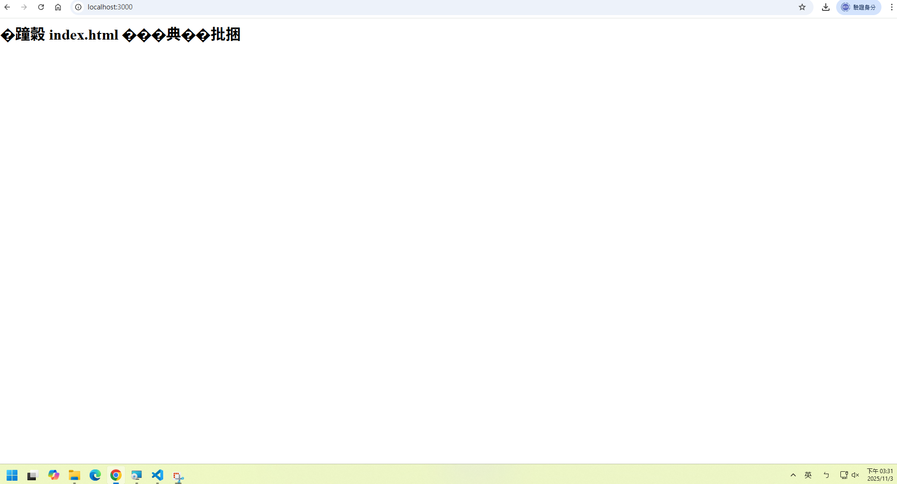
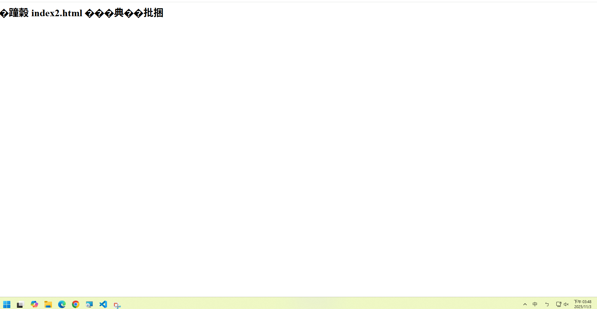

# 第2次隨堂題目-隨堂-QZ2
>
>學號：112111101   (學號和姓名都要寫)
><br />
>姓名：陳姸卉
>

本份文件包含以下主題：(至少需下面兩項，若是有多者可以自行新增)
- [x] 說明內容

## 說明程式與內容

開始寫說明，該說明需說明想法，
並於之後再對上述想法的每一部分將程式進一步進行展現，
若需引用程式區則使用下面方法，
若為.cs檔內程式除了於敘述中需註明檔案名稱外，
還需使用語法` ```語言種類 程式碼 ``` `，其中語言種類若是要用python則使用py，java則使用java，C/C++則使用cpp，
下段程式碼為語言種類選擇csharp使用後結果：

```csharp
public void mt_getResult(){
    ...
}
```

若要於內文中標示部分網頁檔，則使用以下標籤` ```html 程式碼 ``` `，
下段程式碼則為使用後結果：

```html
<%@ Page Language="C#" AutoEventWireup="true" ...>

<!DOCTYPE html>

<html xmlns="http://www.w3.org/1999/xhtml">
<head runat="server">
<meta http-equiv="Content-Type" ...>
    <title></title>
</head>
<body>
    <form id="form1" runat="server">
        <div>
        </div>
    </form>
</body>
</html>
```
更多markdown方法可參閱[https://ithelp.ithome.com.tw/articles/10203758](https://ithelp.ithome.com.tw/articles/10203758)

請在撰寫"說明程式與內容"該塊內容，請把原該塊內上述敘述刪除，該塊上述內容只是用來指引該怎麼撰寫內容。

1. a.

Ans: 
1.(1)陣列、物件
  (2)
  const products = [
  { name: "keyboard", stock: 25 },
  { name: "mouse", stock: 5 },
  { name: "monitor", stock: 8 },
  { name: "usb cable", stock: 40 }
];

宣告變數、存放資料、描述每個資料


1. b.

Ans:
```js
const products = [
  { name: "keyboard", stock: 25 },
  { name: "mouse", stock: 5 },
  { name: "monitor", stock: 8 },
  { name: "usb cable", stock: 40 }
];

function getLowStock(products) {
  const lowStockItems = products
    .filter(item => item.stock < 10)
    .map(item => item.name);

  console.log(`庫存少於10的項目 : ${JSON.stringify(lowStockItems)}`);
}

getLowStock(products);
```


<!-- 請撰寫時，最後一句話再寫一次 -->


1. c.

Ans:

<!--  請撰寫時，第一句話再寫一次  -->

2. a.

Ans: http://localhost:3000


[alt text](./2a-1圖檔.png)
<!--  請撰寫時，第一句話再寫一次  -->

2. b.

Ans:

<!--  請撰寫時，第一句話再寫一次  -->

2. c.

Ans:

<!--  請撰寫時，第一句話和最後一句再寫一次  -->

2. d.

Ans:4


